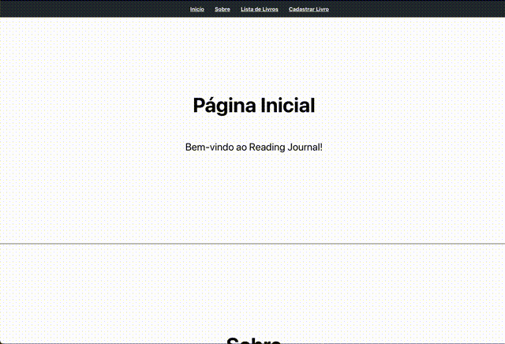

## Nome: `Gabriel Silva Lima`

Para executar este projeto:

1. Entre na pasta do projeto no terminal:
```
cd local-baixado/pucrs-reading-journal
```

2. Rode npm install para instalar as dependências do projeto:
```
npm install
```

3. E em seguida, npm start, para iniciar a execução do projeto:
```
npm start
```

Após execução do projeto, este é o resultado esperado no navegador:


## Introdução

Este projeto contém uma estrutura básica para um CRUD de um Reading Journal, desenvolvido na Disciplina Desenvolvimento de Sistemas Frontend do Curso de Graduação Online da PUCRS.

## Componentes

Os componentes estão no diretório `./src/components` e eles possuem as seguintes características:

- BookFormComponent:
  - `props`
    - booklist: um array com a lista de livros;
    - setBookList: função para atualizar a lista de livros;
    - inputNameRef: referência para o input de nome do livro;
    - book: objeto com as informações do livro a ser editado;
    - setBook: função para atualizar o estado do livro a ser editado;
  - Descrição: este componente é responsável por cadastrar novos livros na lista e também é responsável por validações de campos requeridos ou se algum valor foi inserido incorretamente. Também permite a edição de livros existentes.

- BookListComponent:
  - `props`
    - booklist: um array com a lista de livros;
    - setBookList: função para atualizar a lista de livros;
    - focusFunction: função para focar no input de nome do livro;
    - editBook: função para definir o livro a ser editado;
  - Descrição: este componente é responsável por listar os livros cadastrados, permitir a remoção de livros, buscar pelo autor ou comprar o livro no link cadastrado. Também permite a edição de livros existentes.

- TitleComponent:
  - `props`
    - title: título da seção;
    - paragraph: parágrafo descritivo da seção;
    - titleID: ID do título para navegação;
  - Descrição: este componente é responsável por renderizar os títulos e parágrafos das seções.

- NavbarComponent:
  - `props`
    - menuItems: array com os itens do menu de navegação;
  - Descrição: este componente é responsável por renderizar a barra de navegação.

## Conclusão

Este projeto é uma aplicação CRUD para um Reading Journal, demonstrando funcionalidades úteis para o desenvolvimento de projetos em ReactJS.
